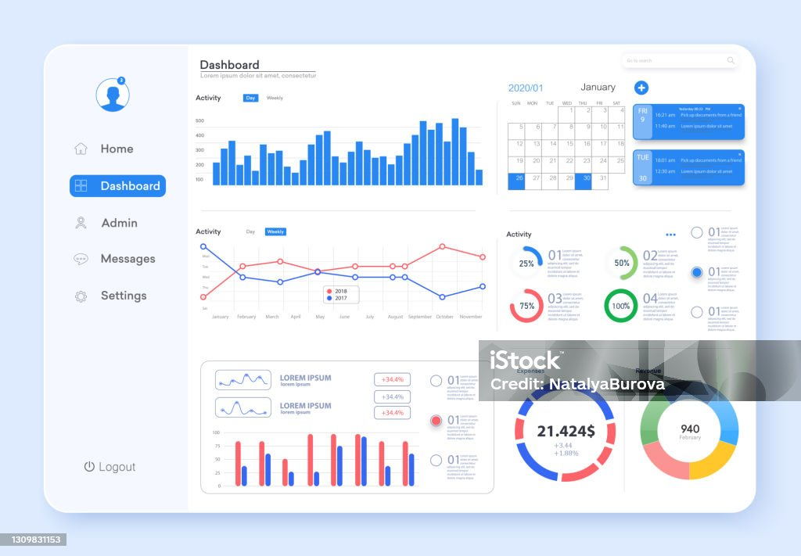

# Fcb_1st_project
# Overview
This project aims to analyze customer purchasing behavior for an e-commerce company. 

# Table of Contents 
- Introduction
- Tools used
- Data
- Table
- Analysis
- SQL Query
- Results
- Contributing
- License
  
## Introduction 
The goal of this project is to understand customer preferences and patterns in purchasing products from our e-commerce platform. The analysis will involve exploring the dataset, identifying trends, and making recommendations for improving customer experience and increasing sales.

## Tools Used
- Python: Data manipulation and analysis
- Pandas: Data processing and analysis
- SQL: Data querying and aggregation
- Matplotlib: Data visualization


## Data 
The dataset contains information on customer transactions, including purchase history, product details, and demographic information. It is stored in a CSV format and has been preprocessed to remove any missing values and outliers. 

## Table
Here's a sample table summarizing the key metrics from the analysis:

| customer_id  |  order_total |
|----------|---------|
| 1001  |  100 |
| 1002  |  450 |
| 1003  |  7180 |
| 1004  |  500 |
| ....  |  .... |


## Analysis 
The analysis will include the following steps: 
- Exploratory data analysis (EDA) to understand the distribution of key variables and identify any correlations. 
- Association rule mining to discover patterns in product purchases.
- Predictive modeling to forecast future sales and identify potential upselling opportunities.

## SQL Query
Here's an example SQL query to retrieve the total revenue generated by each customer:

```sql
SELECT 
    customer_id, 
    SUM(order_total) AS total_revenue
FROM 
    orders
GROUP BY 
    customer_id;
```
  
## Results 
Key findings from the analysis will be summarized and presented in the form of visualizations, tables, and descriptive statistics. Insights gained from the analysis will be used to make data-driven recommendations for marketing strategies, product recommendations, and customer segmentation. 



## Contributing
Contributions to the project are welcome. If you have any suggestions, bug reports, or feature requests, please open an issue or submit a pull request on GitHub. 

## License 
This project is licensed under the [MIT License](https://opensource.org/license/mit). You are free to modify and distribute the code for both commercial and non-commercial purposes.
